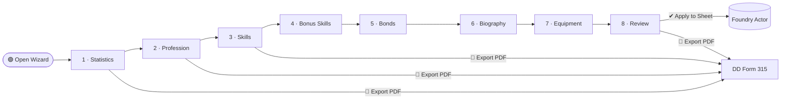

# Delta Green Character Creation Wizard — Foundry VTT Module

A step-by-step character creation wizard for the **Delta Green** RPG system in Foundry VTT. A port of the [DELTA-GREEN-STATS](https://github.com/PigeonFX/DELTA-GREEN-STATS) web app — same profession data, same skill rules, same optional pick logic — packaged as a Foundry module.

## Wizard Flow



> Export PDF is available on **every step** — not just Review.

---

## Step Previews

<details>
<summary>Step 1 — Statistics</summary>

```
┌─────────────────────────────────────────────────────────────┐
│  STATISTICS                                                  │
│  ● ○ ○ ○ ○ ○ ○ ○ ○   Step 1 of 9                           │
│─────────────────────────────────────────────────────────────│
│  Points remaining: 12 / 72                                  │
│                                                             │
│  ┌───────┐ ┌───────┐ ┌───────┐                             │
│  │  STR  │ │  CON  │ │  DEX  │                             │
│  │  [−] 10 [+]     │ …                                     │
│  └───────┘ └───────┘ └───────┘                             │
│  ┌───────┐ ┌───────┐ ┌───────┐                             │
│  │  INT  │ │  POW  │ │  CHA  │                             │
│  │  [−] 10 [+]     │ …                                     │
│  └───────┘ └───────┘ └───────┘                             │
│                                                             │
│  [🎲 Roll All]  [🔀 Randomize]  [↺ Reset]                  │
│─────────────────────────────────────────────────────────────│
│  [📄 Export PDF]                         [Next →]          │
└─────────────────────────────────────────────────────────────┘
```
</details>

<details>
<summary>Step 3 — Skills (optional picks at top, required table below)</summary>

```
┌─────────────────────────────────────────────────────────────┐
│  SKILLS                           ○ ○ ● ○ ○ ○ ○ ○ ○        │
│─────────────────────────────────────────────────────────────│
│  ┌ Choose any 2 of these: ─────────────────────────────┐   │
│  │  Optional picks: 1 / 2                               │   │
│  │                                                       │   │
│  │  ☑  Anthropology                              40%    │   │
│  │  ☐  Archeology                                40%    │   │
│  │  ☐  HUMINT                                    50%    │   │
│  │  ☐  Navigate                                  50%    │   │
│  │  ☐  Ride                                      50%    │   │
│  │  ☐  Search                                    60%    │   │
│  │  ☐  Survival                                  50%    │   │
│  └───────────────────────────────────────────────────────┘  │
│                                                             │
│  ┌ Specialty Skills ────────────────────────────────────┐   │
│  │  Foreign Language  [Spanish ▾]               50%    │   │
│  │  Foreign Language  [Chinese ▾]               40%    │   │
│  └───────────────────────────────────────────────────────┘  │
│                                                             │
│  Required skills (automatically assigned):                  │
│  ┌──────────────────────────┬───────┐                       │
│  │ Bureaucracy              │  40   │                       │
│  │ History                  │  60   │                       │
│  │ Occult                   │  40   │                       │
│  │ Persuade                 │  40   │                       │
│  └──────────────────────────┴───────┘                       │
│─────────────────────────────────────────────────────────────│
│  [← Back]    [📄 Export PDF]                  [Next →]     │
└─────────────────────────────────────────────────────────────┘
```
</details>

<details>
<summary>Step 8 — Review → Apply to Sheet</summary>

```
┌─────────────────────────────────────────────────────────────┐
│  REVIEW                           ○ ○ ○ ○ ○ ○ ○ ○ ●        │
│─────────────────────────────────────────────────────────────│
│  Agent:    Marcus Webb                                      │
│  Profession: Federal Agent          Bonds: 3               │
│                                                             │
│  STR 12  CON 14  DEX 11  INT 13  POW 10  CHA 10           │
│  HP 13   WP 10   SAN 50  BP 40                             │
│                                                             │
│  Skills (sample)                                           │
│    Alertness 50  Firearms 50  HUMINT 60  Persuade 50       │
│    Unarmed Combat 60  …                                    │
│                                                             │
│  Bonds                                                     │
│    Sarah Webb (Spouse) · Score 10                          │
│    …                                                       │
│─────────────────────────────────────────────────────────────│
│  [← Back]    [📄 Export PDF]          [✔ Apply to Sheet]  │
└─────────────────────────────────────────────────────────────┘
```
</details>

---

## Requirements

- Foundry VTT v13+
- [Delta Green system](https://github.com/deltagreen-foundryvtt/delta-green-foundry-vtt-system) installed and active

## Installation

1. Copy the `delta-green-agent-wizard` folder into your Foundry `Data/modules/` directory.
2. Launch Foundry and enable the module in your world's Module Management screen.

## Usage

Open any **Agent** actor sheet. A **Wizard** button appears in the top bar of the sheet. Click it to launch the wizard:

1. **Statistics** — Set STR / CON / DEX / INT / POW / CHA via point-buy (72 pts), random dice (4d6 drop lowest), or manual entry.
2. **Profession** — Choose from all official Delta Green professions. Full description and bond limit shown.
3. **Skills** — Optional profession skills appear at the top as checkboxes with a pick counter enforcing the correct limit (1–5 depending on profession). Required specialty skills (Foreign Language, Science, Craft, etc.) have inline text inputs. The full required skills table is shown below for reference.
4. **Bonus Skills** — 8 bonus skill picks from your Agent's background. Choose from preset background packages or pick individually. Specialty skills support free-text subspecialties.
5. **Bonds** — Add bonds up to the profession's allowed maximum. Suggest random bonds from themed pools (Friends & Family, Delta Green, Underworld, LGBTQ+, PISCES).
6. **Biography** — Name, employer, nationality, sex, age, education, physical description, motivations, and personal notes.
7. **Equipment** — Choose a preset loadout or browse the full catalog. Filter by category or search by name.
8. **Review** — Check everything, then click **Apply to Sheet** to write all data to the Foundry actor.

### PDF Export

An **Export PDF** button is available on every step of the wizard (not just Review). It exports a filled DD Form 315 — the official Delta Green character sheet — using whatever data has been entered so far. Weapons, skills, bonds, specialty instances, personal details, and distinguishing features are all mapped to the correct PDF fields.

### Persistence

Wizard progress is automatically saved to the actor's flags after every step. If you close the wizard, disconnect, or reload Foundry, reopening the wizard on the same agent resumes exactly where you left off. Progress is cleared when you click **Apply to Sheet**.

To re-run the wizard on an agent that already has data (e.g. to correct a mistake), simply open the wizard again — the saved state will load.

## File Layout

```
delta-green-agent-wizard/
  module.json
  scripts/
    main.js          ← Foundry hooks, sheet bar button injection, actor PDF export
    wizard.js        ← ApplicationV2 step-by-step wizard class
    pdf-export.js    ← DD Form 315 PDF field mapper (pdf-lib)
    professions.js   ← All official profession data (ported from DELTA-GREEN-STATS)
    bonds.js         ← Bond suggestion pool (ported from DELTA-GREEN-STATS)
    bio-data.js      ← Random biography generator
    equipment.js     ← Full equipment catalog with weapon stats
  templates/
    wizard.hbs       ← Handlebars template for all wizard steps
  styles/
    module.css       ← Dark-themed UI matching the DG system aesthetic
  assets/
    Delta-Green-RPG-Character-Sheet.pdf  ← Fillable DD Form 315 template
```

## Relationship to DELTA-GREEN-STATS

This module is a direct port of the [DELTA-GREEN-STATS](https://github.com/PigeonFX/DELTA-GREEN-STATS) web app to Foundry VTT. The profession data (`professions.js`), bond pool (`bonds.js`), skill rules, optional pick limits, and PDF field mappings are kept identical to the source. Only the presentation layer differs — Handlebars templates and Foundry ApplicationV2 instead of plain HTML/JS DOM manipulation.

## License

Released under [MIT](LICENSE).
